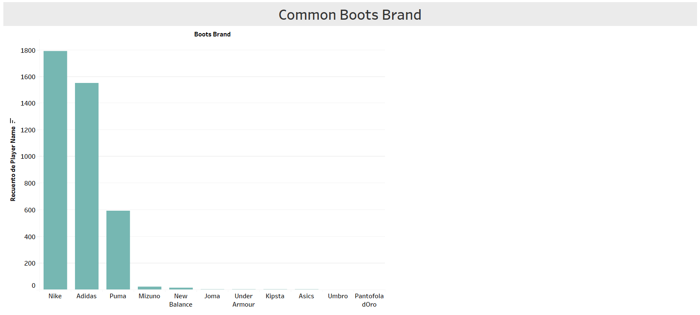
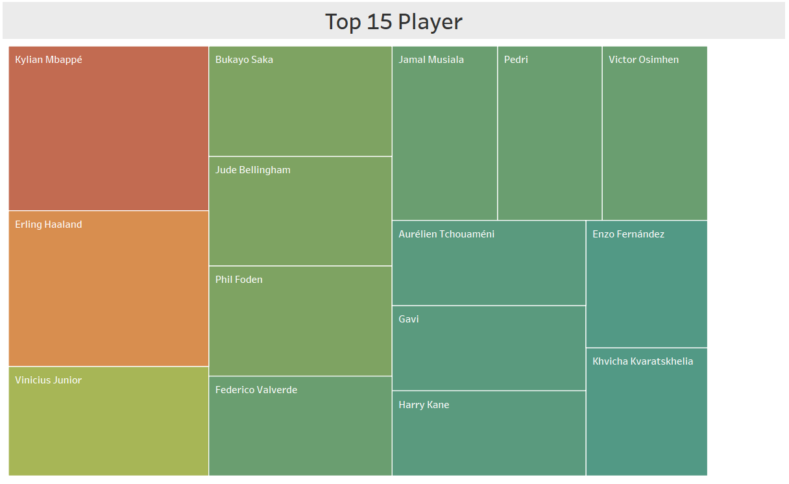

# EDA-Project

## Índice

1. [Descripción](#descripción)
2. [Objetivo principal](#objetivo)
3. [Base de datos](#datos)
4. [Análisis](#analisis)
5. [Conclusiones](#conclusiones)
6. [Enlace](#enlace)

<a name="descripción"/>

## Descripción

En el siguiente proyecto nos encargaremos de extraer una base de datos, acomodar y limpiar dicha base de datos y, por último, dar una visualización a esa información.

<a name="objetivo"/>

## Objetivo principal

Nuestro objetivo principal será dar una buena visualización a las conclusiones que podamos sacar de nuestra base de datos.

<a name="datos"/>

## Base de datos

La base de datos la obtenemos de Kaggle.

https://www.kaggle.com/

 

<a name="analisis"/>

## Análisis

### Common Boots Brand & Top 5

En primer lugar, observamos las marcas de botas de fútbol más populares en nuestra base de datos. Luego, utilizamos herramientas de visualización de datos para comparar la frecuencia de uso de estas marcas en las cinco grandes ligas del fútbol mundial. Esta visualización nos permitió identificar las marcas más utilizadas por los jugadores de fútbol en cada liga, proporcionando información valiosa para entender las preferencias de los jugadores y la tendencia del mercado en la industria de las botas de fútbol.

 

### Top 15 players

En segundo lugar, realizamos un análisis adicional para determinar el valor de mercado actual de los jugadores que utilizan las botas de fútbol presentes en nuestra base de datos. Para esto, generamos un listado de los 15 jugadores con el valor de mercado más alto que utilizan cada una de estas marcas de botas de fútbol. Este análisis nos permitió identificar la relación entre la elección de botas de fútbol de un jugador y su valor en el mercado, lo que puede ser útil para empresas de marketing deportivo y marcas de botas de fútbol que buscan establecer asociaciones con jugadores de alto perfil.

 

### Boots Top Player

En tercer lugar, obtuvimos el recuento de los distintos modelos de botas de futbol utilizados por los jugadores patrocinados por cada marca, así como la cantidad de botas utilizadas de acuerdo al jugador que las patrocina. Utilizando los datos de nuestra base de datos, pudimos obtener información detallada sobre los modelos de botas de fútbol utilizados por los jugadores en cada liga, y la cantidad de botas de cada modelo utilizadas por los jugadores patrocinados por cada marca.

 

### Market Value Vary

Y por último, realizamos un análisis de varianza para evaluar la relación entre el valor de mercado de los jugadores de nuestra base de datos, su posición en el campo y su nacionalidad. Este análisis nos permitió identificar la correlación entre estos factores, lo que puede ser útil para las empresas de gestión deportiva, equipos y clubes en la selección y evaluación de jugadores. En general, este análisis ha agregado una dimensión adicional al estudio de las tendencias del mercado de botas de fútbol, y nos ha permitido obtener una comprensión más completa de los factores que influyen en el valor de mercado de los jugadores de fútbol en todo el mundo.

<a name="conclusiones"/>

## Conclusiones

En conclusión, este proyecto ha permitido realizar un análisis detallado de las tendencias del mercado de botas de fútbol. A través de la visualización de datos, hemos identificado las marcas y modelos de botas de fútbol más utilizados por los jugadores, así como su relación con el valor de mercado de los mismos. Además, hemos identificado las preferencias de los jugadores en cuanto a modelos específicos de botas de fútbol, lo que puede ser útil para las empresas de fabricación y marketing en la toma de decisiones de diseño y promoción de sus productos.

<a name="enlace"/>

#### Enlace

https://public.tableau.com/app/profile/juan.andres.gouveia.fardilha/viz/ProjectTableau_16841824230740/ProjectDashboard?publish=yes
